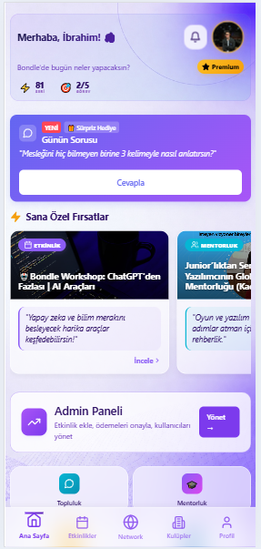
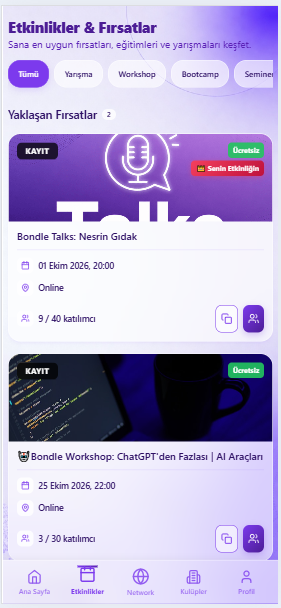
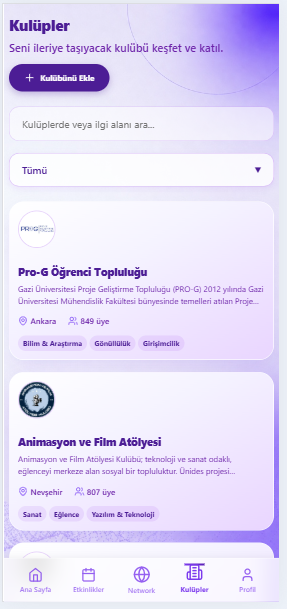
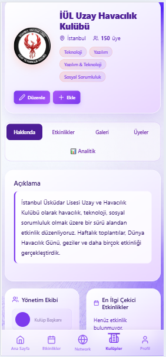
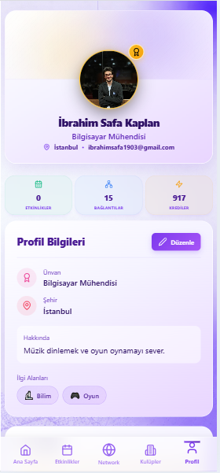

# Bondle - Profesyonel Sosyal Ağ ve Topluluk Uygulaması 🚀

Bondle, üniversite öğrencilerini, genç profesyonelleri, öğrenci kulüplerini ve şirketleri tek bir dijital ekosistemde buluşturan yeni nesil bir profesyonel sosyal ağ ve topluluk yönetimi uygulamasıdır. 

Bu proje; gençlerin ilgi alanlarına uygun kişileri bulup ağ kurmasını (Networking), kulüplerin kendi biletli/ücretsiz etkinliklerini yönetmesini ve kullanıcıların sektör profesyonellerinden mentorluk almasını sağlayan kapsamlı bir altyapıya sahiptir.

## 📱 Uygulama Ekran Görüntüleri

Aşağıda projemizin kullanıcı dostu arayüzünden bazı örnekler bulunmaktadır:

<p align="center">
  
  
  
  
  
</p>

## 🌟 Temel Özellikler
* **Gelişmiş Networking (Ağ Kurma):** İlgi alanlarına (Yazılım, Tasarım, Finans vb.) ve şehirlere göre dinamik kullanıcı filtreleme.
* **Topluluk ve Etkinlik Yönetimi:** Kulüpler için duyuru yapma, etkinlik oluşturma ve katılımcı listesini yönetme panelleri.
* **Gerçek Zamanlı İletişim (WebRTC):** Agora SDK kullanılarak platform içi anlık sesli/görüntülü toplantılar gerçekleştirebilme.
* **Oyunlaştırma (Gamification):** Kullanıcıların platformdaki aktifliğine göre puan kazandığı Liderlik Tablosu ve Premium rozet sistemleri.
* **Fiziksel Entegrasyon:** Etkinlik biletleri için QR Kod oluşturma ve kamera üzerinden bilet doğrulama modülleri.
* **Cross-Platform:** Capacitor entegrasyonu sayesinde hem Web, hem iOS hem de Android cihazlarda kusursuz çalışan duyarlı (responsive) arayüz.

## 🛠️ Kullanılan Teknolojiler

**Frontend (Ön Yüz):**
* React.js (Vite)
* Tailwind CSS & Lucide React (UI/UX)
* React Router DOM (Yönlendirme)
* Context API (State Management)
* Capacitor (Mobil Derleme)

**Backend & Servisler:**
* Node.js / NestJS
* Render (Backend Canlı Sunucu)
* Vercel (Frontend Canlı Sunucu)
* Agora RTC & RTM (Gerçek Zamanlı İletişim)
* Google OAuth 2.0 (Kimlik Doğrulama)

## ⚙️ Kurulum ve Çalıştırma

Projeyi yerel ortamınızda (localhost) çalıştırmak için aşağıdaki adımları izleyebilirsiniz:

1. Depoyu bilgisayarınıza klonlayın:
   ```bash
   git clone https://github.com/safaibrahim9/Bondle-Projesi.git
   ```
2. Frontend dizinine giderek gerekli paketleri yükleyin:
   ```bash
   npm install
   ```
3. Geliştirici sunucusunu başlatın:
   ```bash
   npm run dev
   ```

> 🔒 **Güvenlik Notu:** Uygulamanın güvenliğini sağlamak amacıyla veritabanı bağlantı şifreleri, JWT (JSON Web Token) anahtarları ve Agora API key'lerini barındıran `.env` konfigürasyon dosyaları bu depoya yüklenmemiştir. Proje mimarisi, klasör yapıları ve kaynak kodlar incelenebilir durumdadır.
